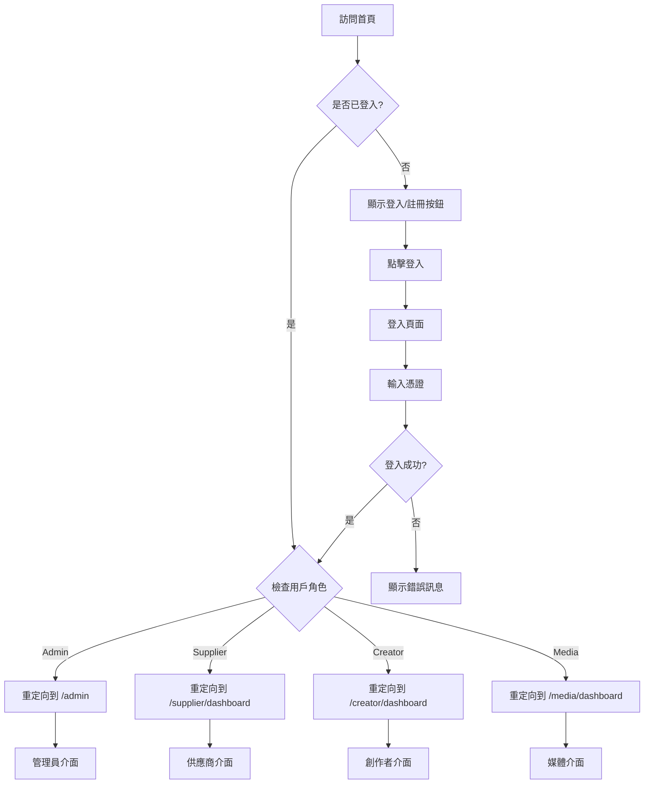

# 旅遊創作者平台 - 用戶角色介面規格書

## 📋 概述

本文件定義了旅遊創作者平台中不同用戶角色登入後應該看到的介面、功能和權限。

## 🎯 角色定義

### 1. 供應商 (Supplier)
**角色描述：** 提供旅遊服務、產品或體驗的業者
**主要目標：** 發布任務、管理合作項目、監控成效

### 2. 創作者 (Creator)
**角色描述：** 內容創作者，包括攝影師、影片製作者、部落客等
**主要目標：** 瀏覽任務、申請合作、創作內容、獲得收益

### 3. 媒體 (Media)
**角色描述：** 媒體機構或平台，負責內容分發和推廣
**主要目標：** 管理媒體資產、分析數據、合作推廣

### 4. 管理員 (Admin)
**角色描述：** 平台管理者
**主要目標：** 系統管理、用戶管理、數據分析

---

## 🏠 首頁導航規劃

### 未登入狀態
```
導航欄: [Logo] [解決方案] [探索] [關於平台] [價格方案] [FAQ] [登入] [註冊] [聯絡我們]
```

### 已登入狀態 (通用)
```
導航欄: [Logo] [解決方案] [探索] [關於平台] [價格方案] [FAQ] [管理後台] [登出] [聯絡我們]
```

---

## 🏢 供應商 (Supplier) 介面規格

### 登入後重定向
- **目標頁面：** `/supplier/dashboard`
- **頁面標題：** "供應商儀表板"

### 主要功能區域

#### 1. 儀表板 (`/supplier/dashboard`)
**頁面內容：**
```
┌─ 歡迎訊息 ──────────────────────────────┐
│ 歡迎回來，{用戶名}！管理您的行銷任務和創作者合作 │
└────────────────────────────────────────┘

┌─ 數據卡片區 ────────────────────────────┐
│ [總任務數: 15] [活躍任務: 8] [總預算: NT$ 450,000] [滿意度: 4.6⭐] │
└────────────────────────────────────────┘

┌─ 快速操作 ──────────────────────────────┐
│ [➕ 創建新任務] [🔄 刷新] [🔔 通知] [📊 分析報告] │
└────────────────────────────────────────┘

┌─ 最新任務狀態 ──────────────────────────┐
│ 任務列表（最近5個）                        │
│ - 台北101觀景台宣傳影片 [收集中] [預算: NT$ 15,000] │
│ - 九份老街攝影專案 [進行中] [申請: 8]            │
└────────────────────────────────────────┘
```

#### 2. 任務管理 (`/supplier/tasks`)
**頁面功能：**
- 任務列表（全部、收集中、評估中、進行中、審核中、發布中、已完成）
- 篩選器（狀態、類型、預算範圍、時間）
- 排序選項
- 批量操作

#### 3. 創建任務 (`/supplier/create-task`)
**表單欄位：**
- 任務基本資訊（標題、描述、類型）
- 預算設定（總預算、付款方式）
- 時程安排（開始日期、截止日期、里程碑）
- 需求規格（內容類型、數量、規格）
- 目標設定（平台、受眾、KPI）

#### 4. 任務詳情 (`/supplier/tasks/{id}`)
**頁面區塊：**
- 任務概覽
- 申請者列表
- 進度追蹤
- 溝通記錄
- 交付成果
- 評價管理

#### 5. 創作者管理 (`/supplier/creators`)
**功能列表：**
- 合作過的創作者
- 創作者評價
- 邀請創作者
- 黑名單管理

---

## 🎨 創作者 (Creator) 介面規格

### 登入後重定向
- **目標頁面：** `/creator/dashboard`
- **頁面標題：** "創作者儀表板"

### 主要功能區域

#### 1. 儀表板 (`/creator/dashboard`)
**頁面內容：**
```
┌─ 歡迎訊息 ──────────────────────────────┐
│ 歡迎回來，{用戶名}！探索新的創作機會和合作項目 │
└────────────────────────────────────────┘

┌─ 數據卡片區 ────────────────────────────┐
│ [申請中: 3] [進行中: 2] [已完成: 15] [總收益: NT$ 85,000] │
└────────────────────────────────────────┘

┌─ 推薦任務 ──────────────────────────────┐
│ 根據您的專長推薦的任務                    │
│ - 台北夜市美食攝影 [預算: NT$ 8,000]        │
│ - 陽明山櫻花季影片 [預算: NT$ 12,000]       │
└────────────────────────────────────────┘

┌─ 進行中的項目 ──────────────────────────┐
│ 目前正在執行的任務列表                    │
└────────────────────────────────────────┘
```

#### 2. 任務瀏覽 (`/creator/tasks`)
**頁面功能：**
- 可申請任務列表
- 進行中的任務
- 已完成的任務
- 篩選器（類型、預算、地區、時間）
- 搜尋功能

#### 3. 作品集 (`/creator/portfolio`)
**內容區塊：**
- 個人簡介
- 作品展示
- 專長領域
- 合作案例
- 客戶評價

#### 4. 收益管理 (`/creator/earnings`)
**功能列表：**
- 收益統計
- 付款記錄
- 稅務文件
- 提款申請

---

## 📺 媒體 (Media) 介面規格

### 登入後重定向
- **目標頁面：** `/media/dashboard`
- **頁面標題：** "媒體管理中心"

### 主要功能區域

#### 1. 儀表板 (`/media/dashboard`)
**頁面內容：**
```
┌─ 歡迎訊息 ──────────────────────────────┐
│ 歡迎回來，{用戶名}！管理您的媒體資產和內容分發 │
└────────────────────────────────────────┘

┌─ 數據卡片區 ────────────────────────────┐
│ [媒體資產: 1,250] [本月上傳: 85] [總流量: 2.5M] [合作項目: 12] │
└────────────────────────────────────────┘

┌─ 熱門內容 ──────────────────────────────┐
│ 本月表現最佳的媒體內容                    │
└────────────────────────────────────────┘
```

#### 2. 媒體資產 (`/media/assets`)
**功能列表：**
- 資產庫管理
- 上傳新媒體
- 分類整理
- 授權管理
- 使用統計

#### 3. 內容分析 (`/media/analytics`)
**分析功能：**
- 流量分析
- 用戶互動
- 轉換率
- ROI 報告

---

## 👤 管理員 (Admin) 介面規格

### 登入後重定向
- **目標頁面：** `/admin`
- **頁面標題：** "系統管理中心"

### 主要功能區域

#### 1. 總覽儀表板 (`/admin`)
**系統概覽：**
- 平台統計數據
- 用戶活躍度
- 交易概況
- 系統健康狀態

#### 2. 用戶管理 (`/admin/users`)
**管理功能：**
- 用戶列表
- 角色管理
- 權限設定
- 帳戶狀態

#### 3. 業務實體管理 (`/admin/business-entities`)
**管理功能：**
- 企業帳戶
- 認證狀態
- 權限分配

#### 4. 任務管理 (`/admin/tasks`)
**監控功能：**
- 所有任務概覽
- 爭議處理
- 品質監控

---

## 🔒 權限控制矩陣

| 路由路徑 | Admin | Supplier | Creator | Media | 未登入 |
|---------|-------|----------|---------|-------|--------|
| `/` | ✅ | ✅ | ✅ | ✅ | ✅ |
| `/admin/*` | ✅ | ❌ | ❌ | ❌ | ❌ |
| `/supplier/*` | ✅ | ✅ | ❌ | ❌ | ❌ |
| `/creator/*` | ✅ | ❌ | ✅ | ❌ | ❌ |
| `/media/*` | ✅ | ❌ | ❌ | ✅ | ❌ |
| `/login` | ❌* | ❌* | ❌* | ❌* | ✅ |
| `/register` | ❌* | ❌* | ❌* | ❌* | ✅ |

*已登入用戶訪問登入/註冊頁面應重定向到對應儀表板

---

## 📱 響應式設計要求

### 桌面版 (≥1024px)
- 側邊導航欄
- 多欄位佈局
- 豐富的圖表和數據視覺化

### 平板版 (768px-1023px)
- 折疊式導航
- 雙欄佈局
- 簡化的圖表

### 手機版 (≤767px)
- 底部導航欄
- 單欄佈局
- 觸控優化的操作

---

## 🎨 UI/UX 設計原則

### 一致性
- 統一的配色方案
- 一致的組件樣式
- 標準化的圖標系統

### 可用性
- 清晰的導航結構
- 直觀的操作流程
- 有效的錯誤處理

### 可訪問性
- 鍵盤導航支援
- 螢幕閱讀器友好
- 足夠的對比度

---

## 🔄 用戶流程圖



---

## 🚀 實作優先順序

### Phase 1: 核心功能
1. ✅ 用戶認證和角色管理
2. ✅ 基礎路由保護
3. 🔄 供應商儀表板
4. 🔄 創作者儀表板

### Phase 2: 進階功能
1. 任務管理系統
2. 媒體資產管理
3. 管理員功能
4. 數據分析

### Phase 3: 優化功能
1. 響應式設計
2. 效能優化
3. 進階權限控制
4. 通知系統

---

## 📋 待辦事項

### 目前問題修復
- [ ] 修復 pittchao@gmail.com 的權限問題
- [ ] 確保 supplier 角色能正確訪問 `/supplier/*` 路由
- [ ] 檢查 AuthGuard 組件的角色驗證邏輯

### 功能開發
- [ ] 實作供應商儀表板頁面
- [ ] 實作創作者儀表板頁面
- [ ] 實作媒體儀表板頁面
- [ ] 完善管理員功能

### 測試驗證
- [ ] 各角色登入流程測試
- [ ] 權限控制測試
- [ ] 跨瀏覽器兼容性測試
- [ ] 響應式設計測試

---

*本文件將隨著開發進度持續更新*


